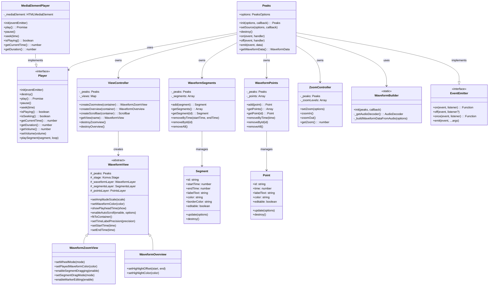
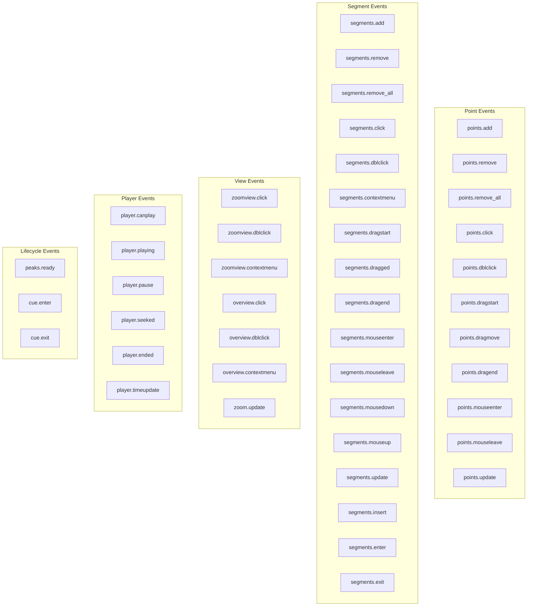
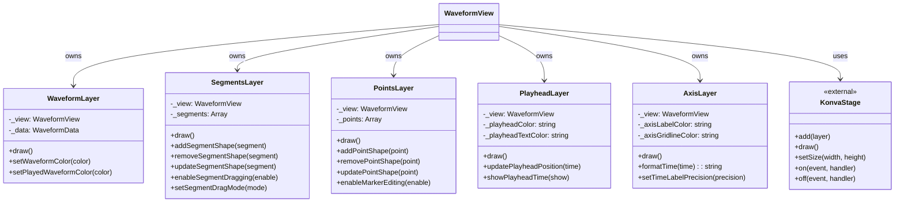

# Peaks.js Interface Analysis

## Overview
Peaks.js provides a client-side JavaScript SDK for displaying and interacting with audio waveforms in web browsers. The library uses a canvas-based rendering approach with Konva.js and follows a modular, event-driven architecture.

## Core Architecture



## Event System



## Rendering Architecture



## Configuration Options

```mermaid
graph LR
    subgraph "Required Options"
        mediaElement[mediaElement: HTMLAudioElement/HTMLVideoElement]
        containers[containers: {zoomview?, overview?}]
    end

    subgraph "Data Source Options"
        dataUri[dataUri: string/object]
        waveformData[waveformData: object/ArrayBuffer]
        webAudio[webAudio: {audioContext, audioBuffer}]
    end

    subgraph "View Options"
        zoomLevels[zoomLevels: Array]
        waveformColor[waveformColor: string/object]
        playedWaveformColor[playedWaveformColor: string/object]
        playheadColor[playheadColor: string]
        showPlayheadTime[showPlayheadTime: boolean]
        axisLabelColor[axisLabelColor: string]
        axisGridlineColor[axisGridlineColor: string]
        fontFamily[fontFamily: string]
        fontSize[fontSize: number]
        fontStyle[fontStyle: string]
        formatPlayheadTime[formatPlayheadTime: Function]
        formatAxisTime[formatAxisTime: Function]
    end

    subgraph "Interaction Options"
        keyboard[keyboard: boolean]
        nudgeIncrement[nudgeIncrement: number]
        emitCueEvents[emitCueEvents: boolean]
        wheelMode[wheelMode: none/scroll/zoom]
        autoScroll[autoScroll: boolean]
        autoScrollOffset[autoScrollOffset: number]
    end

    subgraph "Marker Options"
        createSegmentMarker[createSegmentMarker: Function]
        createSegmentLabel[createSegmentLabel: Function]
        createPointMarker[createPointMarker: Function]
        segmentOptions[segmentOptions: object]
        pointOptions[pointOptions: object]
    end

    subgraph "Player Options"
        player[player: object]
        timeLabelPrecision[timeLabelPrecision: number]
    end
```

## Public API Methods

### Initialization
- `Peaks.init(options, callback)` - Create Peaks instance
- `setSource(options, callback)` - Change audio source
- `destroy()` - Clean up and destroy instance

### Player Control
- `peaks.player.play()` - Start playback
- `peaks.player.pause()` - Pause playback
- `peaks.player.seek(time)` - Jump to time
- `peaks.player.getCurrentTime()` - Get current time
- `peaks.player.getDuration()` - Get duration
- `peaks.player.playSegment(segment, loop)` - Play segment

### Segments API
- `peaks.segments.add(options)` - Add segment
- `peaks.segments.getSegments()` - Get all segments
- `peaks.segments.getSegment(id)` - Get segment by ID
- `peaks.segments.removeByTime(start, end)` - Remove in range
- `peaks.segments.removeById(id)` - Remove by ID
- `peaks.segments.removeAll()` - Clear all segments

### Points API
- `peaks.points.add(options)` - Add point
- `peaks.points.getPoints()` - Get all points
- `peaks.points.getPoint(id)` - Get point by ID
- `peaks.points.removeByTime(time)` - Remove at time
- `peaks.points.removeById(id)` - Remove by ID
- `peaks.points.removeAll()` - Clear all points

### View Management
- `peaks.views.createZoomview(container)` - Create zoom view
- `peaks.views.createOverview(container)` - Create overview
- `peaks.views.destroyZoomview()` - Remove zoom view
- `peaks.views.destroyOverview()` - Remove overview
- `peaks.views.getView(name)` - Get view by name

### Zoom Control
- `peaks.zoom.zoomIn()` - Increase zoom
- `peaks.zoom.zoomOut()` - Decrease zoom
- `peaks.zoom.setZoom(options)` - Set zoom level
- `peaks.zoom.getZoom()` - Get current zoom

### Event Handling
- `peaks.on(event, handler)` - Add event listener
- `peaks.off(event, handler)` - Remove listener
- `peaks.once(event, handler)` - One-time listener
- `peaks.emit(event, ...args)` - Emit event

## Marker Factories

```javascript
// Custom segment marker factory
function createSegmentMarker(options) {
    // options: { layer, view, segment, startMarker, endMarker }
    return new Konva.Shape({
        // Custom shape configuration
    });
}

// Custom segment label factory
function createSegmentLabel(options) {
    // options: { layer, view, segment, text, fontSize, fontFamily }
    return new Konva.Text({
        // Custom text configuration
    });
}

// Custom point marker factory
function createPointMarker(options) {
    // options: { layer, view, point, draggable }
    return new Konva.Shape({
        // Custom shape configuration
    });
}
```

## Player Adapter Interface

```javascript
// Custom player adapter
const customPlayer = {
    init: function(eventEmitter) {
        // Initialize player
    },
    destroy: function() {
        // Cleanup
    },
    play: function() {
        // Start playback
        return Promise.resolve();
    },
    pause: function() {
        // Pause playback
    },
    seek: function(time) {
        // Seek to time
    },
    isPlaying: function() {
        // Return play state
        return false;
    },
    isSeeking: function() {
        // Return seeking state
        return false;
    },
    getCurrentTime: function() {
        // Return current time
        return 0;
    },
    getDuration: function() {
        // Return duration
        return 0;
    }
};
```

## Usage Example

```javascript
// Initialize Peaks.js
const options = {
    containers: {
        zoomview: document.getElementById('zoomview-container'),
        overview: document.getElementById('overview-container')
    },
    mediaElement: document.getElementById('audio'),
    dataUri: {
        arraybuffer: 'audio.dat',
        json: 'audio.json'
    },
    zoomLevels: [256, 512, 1024, 2048, 4096],
    keyboard: true,
    pointMarkerColor: '#006EB0',
    showPlayheadTime: true
};

Peaks.init(options, function(err, peaks) {
    if (err) {
        console.error('Failed to initialize Peaks.js', err);
        return;
    }

    // Add a segment
    peaks.segments.add({
        startTime: 10,
        endTime: 20,
        labelText: 'Test Segment',
        color: '#ff0000',
        editable: true
    });

    // Add a point
    peaks.points.add({
        time: 15,
        labelText: 'Test Point',
        color: '#00ff00'
    });

    // Listen for segment click
    peaks.on('segments.click', function(event) {
        console.log('Segment clicked:', event.segment);
    });

    // Control playback
    peaks.player.play();

    // Zoom operations
    peaks.zoom.zoomIn();
});
```

## Key Design Patterns

1. **Factory Pattern**: Static `Peaks.init()` method for instance creation
2. **Adapter Pattern**: Player abstraction allows different media players
3. **Observer Pattern**: Comprehensive event system for all interactions
4. **Strategy Pattern**: Multiple waveform data sources (precomputed, Web Audio)
5. **Composite Pattern**: Layered canvas rendering with Konva.js
6. **Command Pattern**: User interactions mapped to API methods
7. **Module Pattern**: Clear separation between core modules

## Technical Highlights

- **Canvas-based Rendering**: High-performance visualization using Konva.js
- **Modular Architecture**: Clear separation of concerns between data, views, and interaction
- **Flexible Data Sources**: Support for precomputed data or runtime generation
- **Extensible Markers**: Factory functions for custom segment and point rendering
- **Keyboard Support**: Optional keyboard navigation and shortcuts
- **Responsive Design**: Views can fit to container and handle resize events
- **Time-based Cues**: Support for triggering events at specific times during playback
