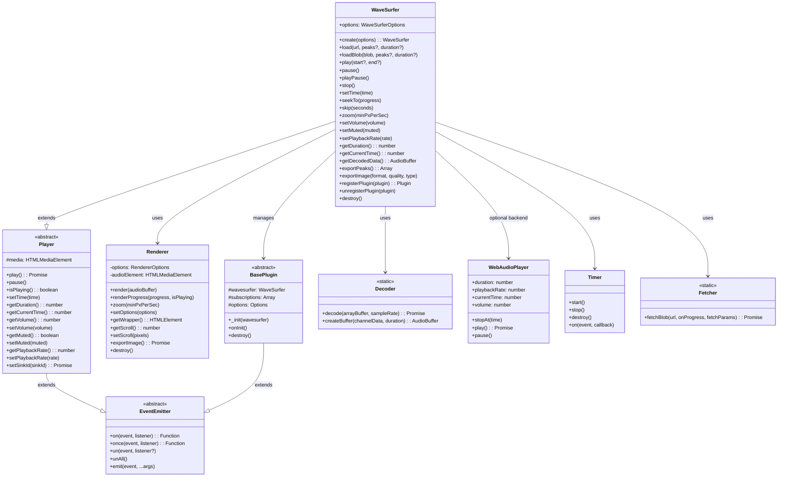
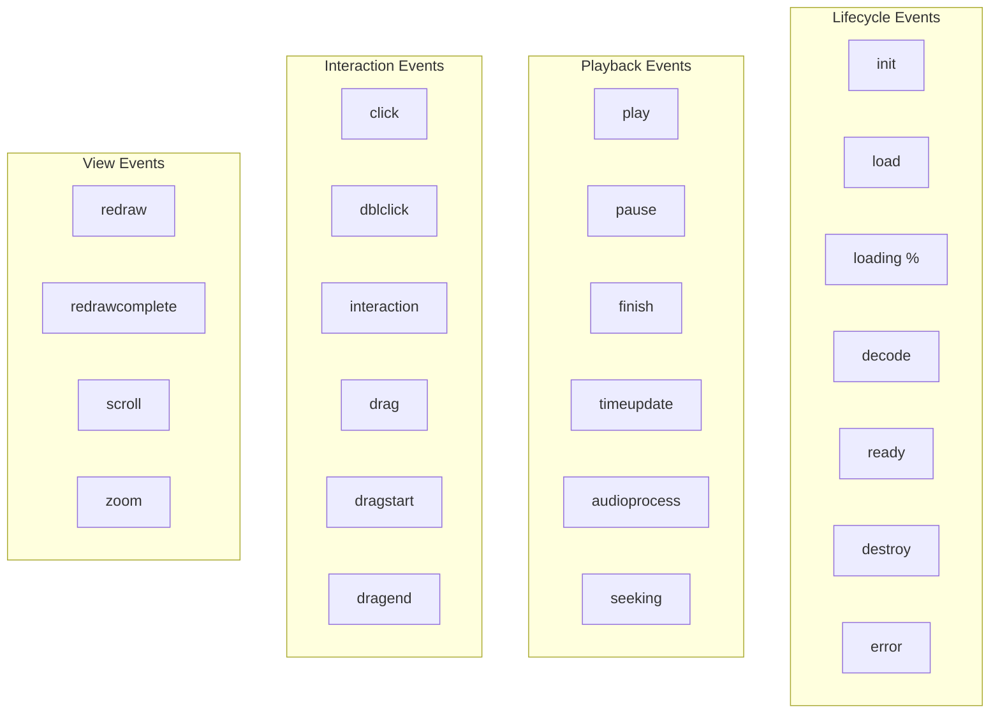
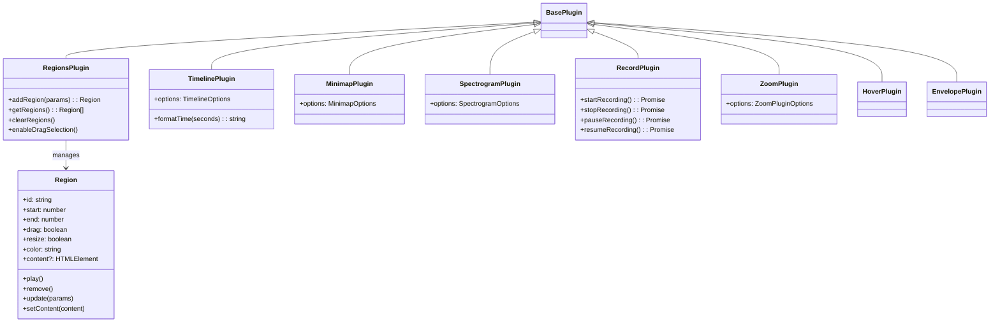
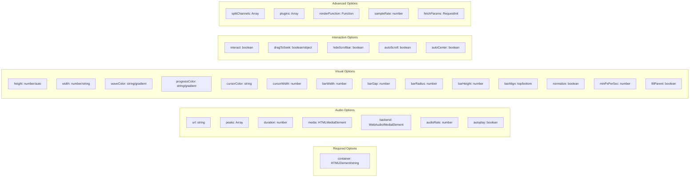

# WaveSurfer.js Interface Analysis

## Overview
WaveSurfer.js provides a comprehensive JavaScript interface for audio waveform visualization and interaction. The library follows an object-oriented architecture with event-driven communication patterns.

## Core Architecture



## Event System



## Plugin Architecture



## Configuration Options



## Public API Methods

### Audio Control
- `load(url, peaks?, duration?)` - Load audio from URL
- `loadBlob(blob, peaks?, duration?)` - Load audio from Blob
- `play(start?, end?)` - Start playback
- `pause()` - Pause playback
- `playPause()` - Toggle play/pause
- `stop()` - Stop and reset to beginning
- `setTime(seconds)` - Jump to specific time
- `seekTo(progress)` - Seek to position (0-1)
- `skip(seconds)` - Skip forward/backward

### Audio Properties
- `getDuration()` - Get total duration
- `getCurrentTime()` - Get current position
- `getVolume()` - Get volume level
- `setVolume(volume)` - Set volume (0-1)
- `getMuted()` - Get mute state
- `setMuted(muted)` - Set mute state
- `getPlaybackRate()` - Get playback speed
- `setPlaybackRate(rate, preservePitch?)` - Set playback speed

### Visualization
- `zoom(minPxPerSec)` - Change zoom level
- `getDecodedData()` - Get decoded AudioBuffer
- `exportPeaks(options)` - Export waveform peaks
- `exportImage(format, quality, type)` - Export as image

### Plugin Management
- `registerPlugin(plugin)` - Add plugin
- `unregisterPlugin(plugin)` - Remove plugin

### Lifecycle
- `destroy()` - Clean up and destroy instance
- `empty()` - Clear waveform

## Usage Example

```javascript
// Create instance
const wavesurfer = WaveSurfer.create({
    container: '#waveform',
    waveColor: '#A8DBA8',
    progressColor: '#3B8686',
    backend: 'WebAudio',
    plugins: [
        RegionsPlugin.create(),
        TimelinePlugin.create({
            container: '#timeline'
        })
    ]
});

// Load and play audio
wavesurfer.load('audio.mp3');

// Event handling
wavesurfer.on('ready', () => {
    wavesurfer.play();
});

wavesurfer.on('region-created', (region) => {
    console.log('Region created', region);
});

// Control playback
wavesurfer.on('finish', () => {
    wavesurfer.seekTo(0);
});
```

## Key Design Patterns

1. **Event-Driven Architecture**: All components communicate through events
2. **Plugin System**: Extensible through standardized plugin interface
3. **Inheritance Hierarchy**: Core functionality inherited from Player and EventEmitter
4. **Separation of Concerns**: Rendering, audio control, and interaction handled by separate modules
5. **Promise-based APIs**: Asynchronous operations return promises
6. **Configuration over Code**: Extensive options for customization without code changes
